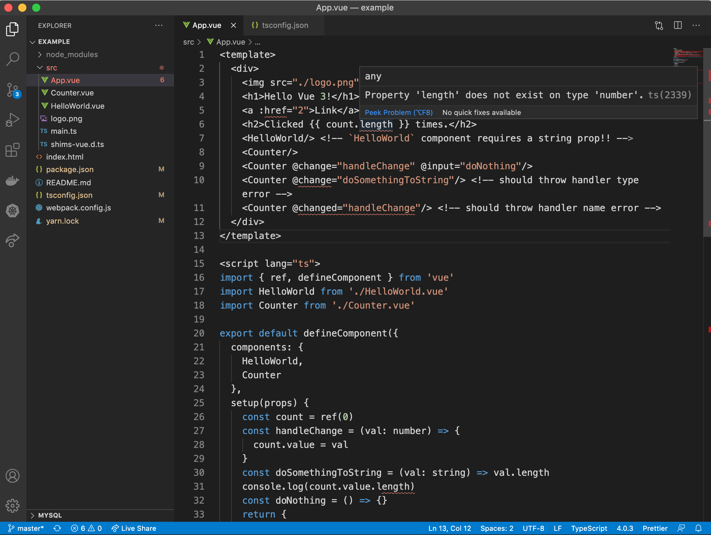
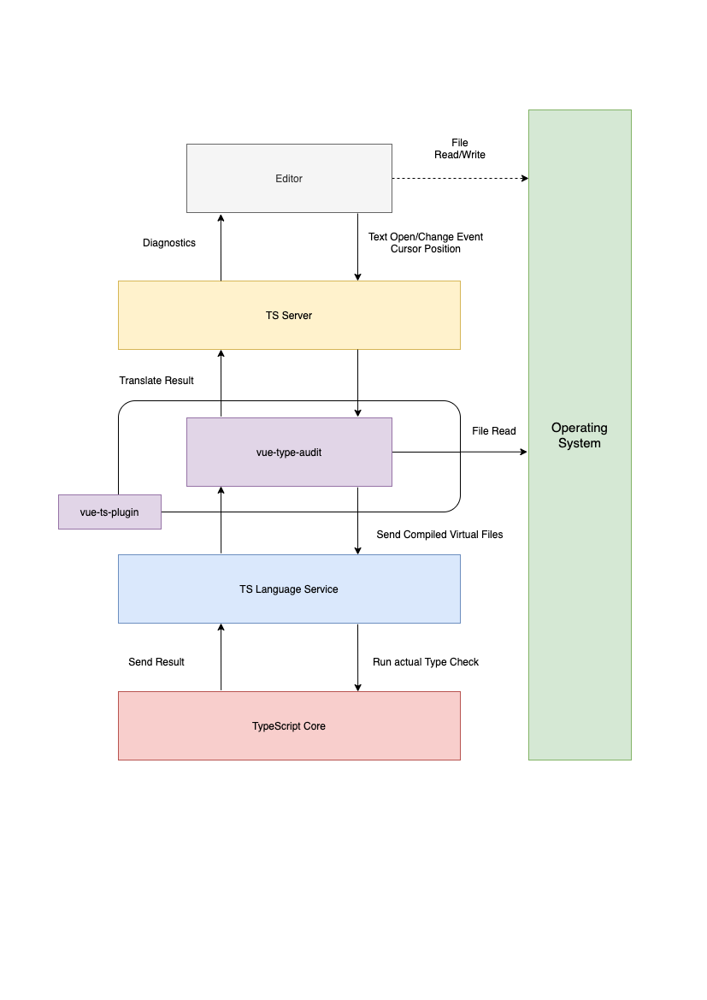

# @andoshin11/vue-ts-plugin
A TypeScript native plugin to run type-check on Vue SFC(Single File Component).

This libary takes a fundamentally different approach from [vetur](https://github.com/vuejs/vetur). 
Please refer to the [Architecture](#Architecture) section to see the detail.



## :warning: Disclaimer
This is an experimental project and has very limited number of features.
Before you try it on any production level products, be sure to know what it does since it's highly likely to cause performance issues.

I strongly reccomend not to use it on production unless you have deep knowledge of TypeScript Server.

**Technical Limitations**
Due to the API compatibilities, this plugin is only expected to work with certain versions of depending libraries.
Make sure to have thses versions set up to have full functionality of itself.

- [vue@3.0.4](https://www.npmjs.com/package/vue/v/3.0.4)
- [typescript@4.1.2](https://www.npmjs.com/package/typescript/v/4.1.2)

## Whas is TypeScript Plugin?
Read [this](https://github.com/microsoft/TypeScript/wiki/Writing-a-Language-Service-Plugin) page.

Basically, it is a feature that developers can use to bring TypeScript's DX to other ecosystem & languages.
Here's the quote from TS official [wiki](https://github.com/microsoft/TypeScript/wiki/Writing-a-Language-Service-Plugin#whats-a-language-service-plugin).

> Instead, plugins are for augmenting the editing experience. Some examples of things plugins might do:
> 
> - Provide errors from a linter inline in the editor
> - Filter the completion list to remove certain properties from window
> - Redirect "Go to definition" to go to a different location for certain identifiers
> - Enable new errors or completions in string literals for a custom templating language

## :rocket: Getting Started
- Set up a Vue project. [Vue CLI](https://cli.vuejs.org/) is recommended for this process.
- `$ yarn add -D @andoshin11/vue-ts-plugin`
- Open VSCode and change the configurations
  - Disable [vetur](https://github.com/vuejs/vetur)
  - Set `typescript.tsserver.pluginPaths` as `["./node_modules"]`
  - Set `files.associations` as `{ "*.vue": "typescript" }`
- Add Plugin info to `tsconfig.json`

```json
// tsconfig.json
{
  "compilerOptions": {
    ...
    "plugins": [
      {
        "name":  "@andoshin11/vue-ts-plugin"
      }
    ]
  }
}
```
- Reload VSCode
- Open a `.vue` file to see the result

## Architecture
This plugin is heavily relying on [vue-type-audit](https://github.com/andoshin11/vue-type-audit), which is a side-project of mine.

All the heavy lifting, like file compilation, virtual file management, sourcemap recovery, and diagnostics formatting are done by [vue-type-audit](https://github.com/andoshin11/vue-type-audit).
This libary mainly focuses on TS Server bridging so that the core functionality of type analyzation for Vue files could remain portable and maintainable.


